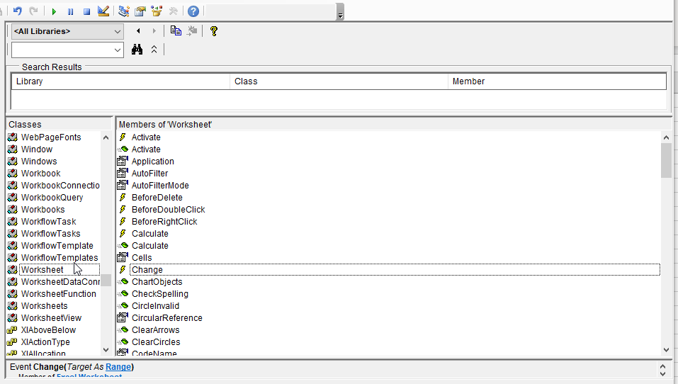

# Excel Connection Sample and Tutorial

This repository includes a working sample (source code and assets) that can synchronize data between NVIDIA Omniverse and Microsoft Excel. This readme containes two major sections. The first section explains how to use the sample as-is. The second section is a tutorial that explains how the sample was developed. 

## Using the sample

In order to use this sample you must install *Microsoft Excel*, install *Omniverse*, clone this repository, and add configure *Omniverse* to include the provided extension. Then the extension can be used as described below.

### Install Microsoft Excel

If you do not have *Excel* installed, it can be purchased and downloaded [here](https://www.microsoft.com/en-us/microsoft-365/excel).

### Install Omniverse Launcher and an Omniverse App

1. Install *Omniverse Launcher*: [download](https://www.nvidia.com/en-us/Omniverse/download)
2. Install and launch an *Omniverse* app through the launcher such as *Omniverse Code*.

### Add a new extension to your *Omniverse App*

1. Fork and clone this repo, for example in `C:\projects\kit-extension-sample-excel-connection`
2. In the *Omniverse App* open extension manager: *Window* &rarr; *Extensions*.
3. In the *Extension Manager Window* click on the *hamburger menu* &rarr; *settings*.
4. In the settings page there is a list of *Extension Search Paths*. Click on the *plus* button and add the cloned repo's `exts` subfolder. If you used the example clone path, the `exts` filder would be here: `C:\projects\kit-extension-sample-excel-connection\exts`


5. Now you can find `omni.sample.excel_connection` extension in the top left search bar. Select and enable it.
6. The "Excel Connection" window will pop up. *Extension Manager* watches for any file changes. You can try changing some code in this extension and see them applied immediately with a hotreload.

### Open the Scene

Use the *Omniverse* app installed previously to open *Warehouse_Scene.usd* included in the *Assets* folder of the repository.

### Enter the Spreadsheet Path

Copy the path of *Warehouse_BOM.xlsx* included in the *Assets* folder of the repository and paste it into the *Spreadsheet Path* field of the *Excel Connection* extension as shown in the image below: 


### Connect Omniverse to Microsoft Excel

Finally, click the *Connect* button in the *Excel Connection* Window. You can now move a pallet in Omniverse and see its position values change in *Excel* or you can change position values in *Excel* and see pallets move in *Omniverse*.


> **_Note_**: Sometimes *Excel* instances do not close completely and this causes unexpected behavior; This can happen if the extension is reloaded without clicking on the disconnect button. If the connection is not working well, open the windows task manager and manually close all open Excel applications.

## Tutorial

Follow along with this tutorial to write your own extension that can transfer data back and forth between Microsoft Excel and NVIDIA Omniverse. This tutorial not only demonstrates how to connect Excel and Omniverse specifically, but also serves as a template you can use to connect to other COM applications such as other Microsoft Office Applications as well as CATIA V5. It can also serve as a starting point to connect to applications that have Python, .NET or other libraries available.

### User Interface

To get started, build a new extension from the extension template and open the `extension.py` file as demonstrated in [this video](https://www.youtube.com/watch?v=eGxV_PGNpOg).

From there, find the `on_startup` function; this is the code that runs when your extension is launched and it is where the user interface is built. Here is the default `on_startup` function:

```Python
def on_startup(self, ext_id):
    print("[omni.hello.world] MyExtension startup")

    self._count = 0

    self._window = ui.Window("My Window", width=300, height=300)
    with self._window.frame:
        with ui.VStack():
            label = ui.Label("")
            

            def on_click():
                self._count += 1
                label.text = f"count: {self._count}"

            def on_reset():
                self._count = 0
                label.text = "empty"

            on_reset()

            with ui.HStack():
                ui.Button("Add", clicked_fn=on_click)
                ui.Button("Reset", clicked_fn=on_reset)
```
replace that function with this one:

```Python
def on_startup(self, ext_id):
    print("[omni.sample.excel_connection] omni sample Excel_connection startup")

    self._window = ui.Window("Excel Connection", width=600, height=200)

    with self._window.frame:
        with ui.VStack():

            self._sheet_path = ui.SimpleStringModel(r"C:\Warehouse_BOM.xlsx")
            with ui.HStack(style={"margin": 5}, height=40):
                ui.Label("Spreadsheet Path:", width=50)
                ui.StringField(self._sheet_path, width=500)

            with ui.HStack(style={"margin": 5}, height=40):
                ui.Spacer()
                ui.Button("Connect", clicked_fn=self.on_Connect_Click, width=300)
                ui.Button("Disconnect", clicked_fn=self.on_Disconnect_Click, width=300)
                ui.Spacer()
```

Basic formatting and style changes are made throughout the code block, but the important code to note is the code after the line: `with self._window.frame:`. Here is where most of the user interface is built. You will see that there is a vertical stack which contains two horizontal stacks. This creates two rows in the user interface, and each row has two columns. The first row has a string field where the user can enter a path to the Excel spreadsheet they would like to connect to Omniverse. The second row has buttons that can connect or disconnect the given spreadsheet.

Take note that each `ui.Button` has a `clicked_fn` argument passed into its constructor. This is the function that will run when the button is clicked. For now, let's simply define the functions and have them do nothing, so that our UI is complete and the extension will build. This can be done with the following code block:

```Python
def on_Connect_Click(self):
    pass        

def on_Disconnect_Click(self):
    pass
```

And so, with just a few lines of code the user interface for the Excel connector is complete. Next we will add the dependencies required to call the Excel API from within the extension.

### Adding the `Win32Com` Dependencies

Many applications have automation API libraries. These libraries come in a wide variety of languages and formats; this sample is helpful for any libraries that can be accessed from Python. If the libraries are Python libraries, which is common, this is very straightforward. .NET libraries are also very common. While not quite as simple to import as Python libraries, .NET libraries can be brought in by using the Python.NET library. COM libraries are a bit trickier to use, which is one reason they were chosen for this tutorial. Hopefully demonstrating how to use COM libraries will serve as a head start for those who want to use Python, .NET, COM or other technologies.

If there is one code snippet to learn from this sample, this is it:
    
```Python
    import omni.kit.pipapi

    omni.kit.pipapi.install("pywin32")
```

This code snippet installs pip packages that are not distributed with Omniverse, opening up a wide range of possibilities. In this case it installs `pywin32`, a library that allows us to work with COM .dlls that are registered on the user's local machine.

> **_Note_**: First-time pip installation of `pywin32` sometimes fails from within the Omniverse environment. If this happens copy the attempted pip command from the console logs and run it in a command prompt.

The next step is less common when installing a package and probably will not be necessary unless you are working with COM APIs. In order to use the `win32com.client` library which is required to access COM APIs, a few environment variables must be set within the Omniverse environment. If you were to use `pywin32` in a local Python environment, you would first install the package and then run an installer that sets these environment variables. We cannot do this within the Omnviverse environment, so instead we essentially install the library into the environment by hand. In the case that you are working with COM libraries and thus `pywin32`, you can use the exact snippet included below:

```Python
# you also need to set the following environment variables to install pywin32
import os
import sys
import carb
from pathlib import Path
import Pythonwin.pywin

dlls_path = Path(Pythonwin.pywin.__file__).parent.parent.parent / "pywin32_system32"
com = Path(Pythonwin.pywin.__file__).parent.parent.parent / "win32"
lib = Path(Pythonwin.pywin.__file__).parent.parent.parent / "win32" / "lib"
pywin = Path(Pythonwin.pywin.__file__).parent.parent.parent / "Pythonwin"
carb.log_info(dlls_path)
sys.path.insert(0, str(com))
sys.path.insert(0, str(lib))
sys.path.insert(0, str(pywin))
carb.log_info(sys.path)
os.environ["PATH"] = f"{dlls_path};{os.environ['PATH']}"
carb.log_info(os.environ["PATH"])
# End of pywin32 installation.
```

Now that `pywin32` is completely installed, the next step is to import `win32com.client` which will give access to COM APIs. It is imported as follows:

```Python
# win32com.client lets you work with com libraries
import win32com.client
```

With that, all libraries needed to work with COM APIs have been installed. In the next step we will use this library to access the Excel application.

### Connecting to the Excel Application

The sample connects to Excel in the `on_Connect_Click` function using the following snippet:

```Python
# Link to Excel
self._excel_app = win32com.client.DispatchEx("excel.application")
self._excel_app.Visible = True

# Open workbook
self._excel_workbook = self._excel_app.Workbooks.Open(self._sheet_path.as_string)

try:
    if hasattr(self._excel_workbook, 'Worksheets'):
        self._excel_worksheet = self._excel_workbook.Worksheets(1)
    else:
        self._excel_worksheet = self._excel_workbook._dispobj_.Worksheets(1)
except:
    carb.log_info("Could not find Worksheets attribute")
    return
```

If you have spent time automating Excel with VBA or .NET, this code might be familiar to you. That is because this snippet is calling the same functions from the same libraries! First it launches the Excel application; then it makes sure it is visible. Next, this snippet opens the workbook specified in the user interface. In the next step where a variable is assigned the value of the first worksheet in the worksheets collection, there is an `if` `else` statement with code that might be new to you. This statement checks if the worksheets property is where we would expect it to be; if not it looks for it under the `_dispobj_` property. There appears to be a bug in `win32com` that sometimes includes this extra layer in the class hierarchy and so the worksheets property can be found at either of these two paths.

Now that the extension can open the Excel spreadsheet, the next section will explain how to subscribe to changes from Excel. 


> **_NOTE:_** COM libraries do not typically have Python documentation. In order to learn how to automate these applications, it is recommended you use their VBA documentation and adapt it to Python. The Excel VBA documentation can be found [here](https://learn.microsoft.com/en-us/office/vba/api/overview/excel). It can also be helpful to prototype functionality in the VBA environment and then adapte it to Python.


### Subscribing to Changes from Excel

If you have done Excel automation with VBA, you have probably used the `Worksheet_Change` function to perform actions whenever a user edits a worksheet. We do the same thing in this sample in four steps. First, identify the class and event name you would like to subscribe to. In the case of Excel we can use the VBA object browser to do this. For this sample, we want to listen for changes to a worksheet. We find the `Worksheet` class and if you look there is a `Change` event as shown in the image below:

<center>
    <figure>
        
        <figcaption>You can identify available events through the VBA object browser</figcaption>
    </figure>
</center>

We will make a class with the same name as the class we want to subscribe to plus the `Events` appended to it, in this case `WorksheetEvents`:

```Python
class WorksheetEvents:
```

Next we will add a function with the same name as the event in the VBA object browser, prepended with `On`. In this case that event is `OnChange`. The function will be an instance function, so it will have `self` as an argument, as well as a pointer to any arguments expected from the COM library as demonstrated here:

```Python
def OnChange(self, *args):
```

Put together, this is what the class looks like:

```Python
class WorksheetEvents:

    def OnChange(self, *args):
        pass
```

We then subscribe to that event in the `on_Connect_Click` function with the help of the `win32com.client` library:

```Python
self._excel_events = win32com.client.WithEvents(self._excel_worksheet, WorksheetEvents)
```

Now that we have subscribed to changes from the Excel spreadsheet, in the next section we will take action upon those changes.

### Responding to Changes from Excel

First, in this section we will be working with the Omniverse scene and we will use regular expressions to compare string. So, we will need to import the following libraries:

```Python
import omni.usd
import re
```

with those libraries imported, we will now perform the following steps in the OnChange function created in the last section: 

1. Check if the change happened in a cell that should be tracked
2. Get the prim
3. Move the prim

#### Check Change Address

The first step is to check whether the address of the changed cell is one we are tracking. This is done with the following snippet:

```Python
#1. check if changed cell is one we are tracking
try:
    address_pattern = r'\$[DE]\$[3456]'
    address = str(args[0].Address)
    if not re.match(address_pattern, address):
        return
except Exception as e:
    carb.log_error('Could not detect cell changes' + e)
```

In this snippet we create a regular expression that will match addresses of import and then check whether the changed address matches that pattern. If it does not match we do not continue any further. 

#### Get Prim

The second step is to find the prim path that has been effected by the change. This has been made easy in this sample by storing the prim's path in the spreadhseet to be retrieved later as follows:

```Python
# 2. get prim path from Excel
prim_path_cell_address = r"C" + address[3]
prim_path = WorksheetEvents._excel_worksheet.Range(prim_path_cell_address).Value

stage = omni.usd.get_context().get_stage()
prim = stage.GetPrimAtPath(prim_path)

if not prim.IsValid():
    carb.log_error("Can't find prim at path")
    return
```

The row is taken from the event argment and appended to the column containing the prim path. Then, the value of that cell is read and that string is used within the Omniverse stage to retrieve the prim. It is important to check whether the prim is valid before continuing, because it is very easy to make a mistake when working with prim paths.

It should be noted that a class variable has been added to the `WorksheetEvents` class:

```Python
_excel_worksheet = None
```

This variable has been added so that the connected Excel spreadsheet can be accessed from within the event function. This variable is set in the `on_Connect_Click` function immediately before subscribing to the worksheet's `OnChanged` event:

```Python
WorksheetEvents._excel_worksheet = self._excel_worksheet
self._excel_events = win32com.client.WithEvents(self._excel_worksheet, WorksheetEvents)
```

#### Move Prim

Finally, we will move the prim to its new location with this snippet:

```Python
# 3. move prim to new coordinates        
new_value = WorksheetEvents._excel_worksheet.Range(address).Value

translate = prim.GetAttribute("xformOp:translate").Get()
if (address[1] == "D"):
    translate[0] = new_value
else:
    translate[1] = new_value

prim.GetAttribute("xformOp:translate").Set(translate)
```

First, read the new position from Excel, second read the current position from Omniverse, then assign the new value from Excel to the Omniverse Translation vector and finally, write the new translation vector back to Omniverse.

This is a great point to pause and check your work. You should be able to launch the extension and if you change the position of a prim in Excel, the prim should move in Omniverse. In the next section we will subscribe to Omniverse changes so that we can get data flowing back in the other direction. 


### Subscribing to Changes from Omniverse

Working with Omniverse in Python is more straightforward than working with COM APIs in Python because Omniverse was designed to work with Python. In Omniverse we can deliberately subscribe to changes in a specific prim attribute as shown below:

```Python
watcher = omni.usd.get_watcher()

self.prim_1 = self._stage.GetPrimAtPath(self._excel_worksheet.Range('C3').Value)        
if self.prim_1.IsValid():
    translate_attr = self.prim_1.GetAttribute("xformOp:translate")
    self.watcher1 = watcher.subscribe_to_change_info_path(
        translate_attr.GetPath(), 
        self._translate_changed
        )
```
        
In this snippet, the first prim listed in the Excel spreadsheet is retrieved. If the prim is valid, its translate attribute is assigned to a variable and then a watcher is set that listens for any changes to that attribute. This is then done for the other three pallets in the Excel spreadsheet:

```Python
self.prim_2 = self._stage.GetPrimAtPath(self._excel_worksheet.Range('C4').Value)
if self.prim_2.IsValid():
    translate_attr = self.prim_2.GetAttribute("xformOp:translate")
    self.watcher2 = watcher.subscribe_to_change_info_path(
        translate_attr.GetPath(), 
        self._translate_changed
        )

self.prim_3 = self._stage.GetPrimAtPath(self._excel_worksheet.Range('C5').Value)        
if self.prim_3.IsValid():
    translate_attr = self.prim_3.GetAttribute("xformOp:translate")
    self.watcher3 = watcher.subscribe_to_change_info_path(
        translate_attr.GetPath(), 
        self._translate_changed
        )

self.prim_4 = self._stage.GetPrimAtPath(self._excel_worksheet.Range('C6').Value)
if self.prim_4.IsValid():
    translate_attr = self.prim_4.GetAttribute("xformOp:translate")
    self.watcher4 = watcher.subscribe_to_change_info_path(
        translate_attr.GetPath(), 
        self._translate_changed
        )
```

Don't forget to create the `_translate_changed` function that is called when one of these prims is changed:

```Python
def _translate_changed(self, *args):
    pass
```

With the subscription made, the final step in the tutorial is to respond to changes that come from Omniverse and update Excel.

### Responding to Changes from Omniverse

Responding to changes from Omniverse is very similar to responding to changes from Excel, but has important differences:

1. Check if the translation value has changed
2. Update the values in Excel

It is critical with any bi-directional connection such as this that at some point you check whether values have actually changed. If you do not do this, the connector will enter an infinite loop. So, with that in mind here is the snippet that does this when the Omniverse scene is changed:

```Python
# 1. Check if the translation in Excel is different
translate_attribute = self._stage.GetAttributeAtPath(args[0])
translate = translate_attribute.Get()
prim_path = translate_attribute.GetPrimPath()

next_address = ""
row = 3
found = False
for row in range(3, 7):
    next_address = "C" + str(row)
    next_path = self._excel_worksheet.Range(next_address).Value
    if next_path == prim_path:
        found = True
        break

if not found:
    carb.log_info("prim not found in Excel worksheet")
    return

x_address = "D" + str(row)
excel_x = self._excel_worksheet.Range(x_address).Value

y_address = "E" + str(row)
excel_y = self._excel_worksheet.Range(y_address).Value

# No change in value
if Excel_x == translate[0] and Excel_y == translate[1]:
    return
```

This code snippet first gets the translate value as well as the prim path from the attribute path passed into the event. Next, Excel is searched to find the row that matches the prim path. Once the correct row is found, the X and Y values are read from Excel. Finally, these values are compared with the current Omniverse values and if they are the same, the event handler returns.

If either of the values is different, the code continues with the following snippet:

```Python
    # 2. If so change it.
    self._excel_worksheet.Range(x_address).Value = translate[0]
    self._excel_worksheet.Range(y_address).Value = translate[1]
```

This uses Excel's COM API to change the cell values of interest.

## Conclusion

This sample and tutorial demonstrates how to connect an Excel spreadsheet to NVIDIA Omniverse through a Python extension. It has done this through COM libraries, but the general approach can be applied to many apps and technologies.
