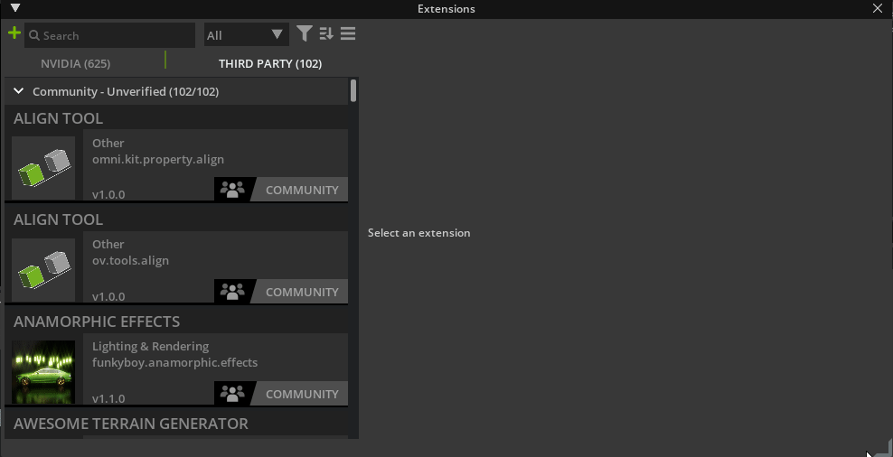
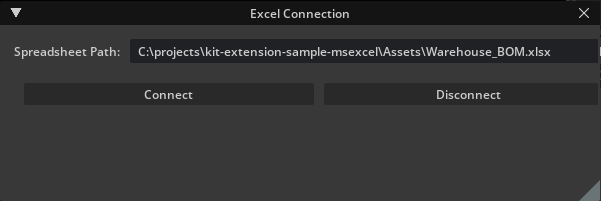

# Excel Connection [omni.sample.excel_connection]

<div style="text-align: center;">
    
</div>

This is a sample extension that connects NVIDIA Omniverse to Microsoft Excel. The full source code along with assets can be found [here](https://github.com/NVIDIA-Omniverse/kit-extension-sample-excel-connection).

## [Tutorial](../tutorial/tutorial.md)

This extension sample includes a step-by-step tutorial to demonstrate how it was written. [Learn how with the tutorial.](../tutorial/tutorial.md)

## Usage

In order to use this sample you must install *Microsoft Excel*, install *Omniverse*, clone this repository, and add configure *Omniverse* to include the provided extension. Then the extension can be used as described below.

### Install Microsoft Excel

If you do not have *Excel* installed, it can be purchased and downloaded [here](https://www.microsoft.com/en-us/microsoft-365/excel).

### Install Omniverse Launcher and an Omniverse App

1. Install *Omniverse Launcher*: [download](https://www.nvidia.com/en-us/Omniverse/download)
2. Install and launch an *Omniverse* app through the launcher such as *Omniverse Code*.

## Adding This Extension to your *Omniverse App*

### Directly from Github

To add a this extension to your Omniverse app directly from github:
1. Go into: Extension Manager &rarr; Hamburger Menu &rarr; Settings &rarr; Extension Search Paths

<div style="text-align: center;">
    
</div>

2. Add this as a search path: `git://github.com/NVIDIA-Omniverse/kit-extension-sample-spawn-prims.git?branch=main&dir=exts`

### With Source

#### Adding the Source to Omniverse

1. Fork and clone this repo, for example in `C:\projects\kit-extension-sample-excel-connection`
2. In the *Omniverse App* open extension manager: *Window* &rarr; *Extensions*.
3. In the *Extension Manager Window* click on the *hamburger menu* &rarr; *settings*.
4. In the settings page there is a list of *Extension Search Paths*. Click on the *plus* button and add the cloned repo's `exts` subfolder. If you used the example clone path, the `exts` filder would be here: `C:\projects\kit-extension-sample-excel-connection\exts`

<div style="text-align: center;">
    
</div>

5. Now you can find `omni.sample.excel_connection` extension in the top left search bar. Select and enable it.
6. The "Excel Connection" window will pop up. *Extension Manager* watches for any file changes. You can try changing some code in this extension and see them applied immediately with a hotreload.

#### Linking with an Omniverse app

For a better developer experience, it is recommended to create a folder link named `app` to the *Omniverse Kit* app installed from *Omniverse Launcher*. A convenience script to use is included.

Run:

```bash
> link_app.bat
```

There is also an analogous `link_app.sh` for Linux. If successful you should see `app` folder link in the root of this repo.

If multiple Omniverse apps is installed script will select recommended one. Or you can explicitly pass an app:

```bash
> link_app.bat --app code
```

You can also just pass a path to create link to:

```bash
> link_app.bat --path "C:/Users/bob/AppData/Local/ov/pkg/create-2022.1.3"
```

### Open the Scene

Use the *Omniverse* app installed previously to open *Warehouse_Scene.usd* included in the *Assets* folder of the repository.

### Enter the Spreadsheet Path

Copy the path of *Warehouse_BOM.xlsx* included in the *Assets* folder of the repository and paste it into the *Spreadsheet Path* field of the *Excel Connection* extension as shown in the image below: 

<div style="text-align: center;">
    
</div>

### Connect Omniverse to Microsoft Excel

Finally, click the *Connect* button in the *Excel Connection* Window. You can now move a pallet in Omniverse and see its position values change in *Excel* or you can change position values in *Excel* and see pallets move in *Omniverse*.

<div style="text-align: center;">
    
</div>

> **_Note_**: Sometimes *Excel* instances do not close completely and this causes unexpected behavior; This can happen if the extension is reloaded without clicking on the disconnect button. If the connection is not working well, open the windows task manager and manually close all open Excel applications.
